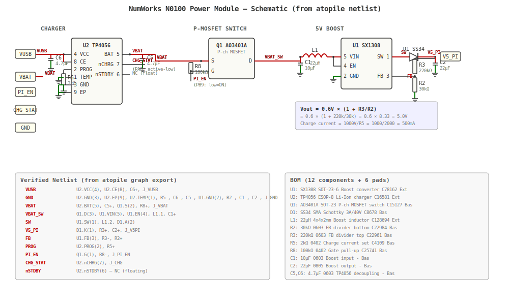

# NumWorks N0100 Power Module

[](LICENSE.txt)
[](https://atopile.io)
[]()

Custom power management board for running a Raspberry Pi Zero 2W inside a NumWorks N0100 calculator.



## Why This Exists

The [numworks-rpi](https://github.com/elektricM/numworks-rpi) project replaces the internals of a NumWorks calculator with a Raspberry Pi Zero 2W running Linux. This requires a custom power solution that can:
- ✅ Charge the Li-Ion battery (replacing the failed RT9526A charger)
- ✅ Protect the battery (overcurrent, overvoltage, undervoltage)
- ✅ Provide stable 5V power for the Raspberry Pi from a 3.7V battery
- ✅ Fit within the calculator's tight space constraints (38x24mm max)

This board does all of that in a single custom PCB.

## What It Does

**Three integrated circuits on one compact board:**

### 1. TP4056 Li-Ion Charger
Replaces the dead RT9526A charger on the original calculator. Standard 1A charge current with automatic termination.

### 2. DW01A + FS8205A Battery Protection
Complete protection circuitry:
- Overcurrent protection (discharge > 3A, charge > 1.5A)
- Overvoltage protection (> 4.25V)
- Undervoltage protection (< 2.4V)
- Auto-recovery when fault conditions clear

### 3. TPS63020 Buck-Boost Converter
Maintains stable 5V output for the Raspberry Pi across the full battery voltage range (3.0V - 4.2V):
- 95% efficiency typical
- Up to 2A output current
- Seamless transition between buck and boost modes

## Why atopile?

This board is designed with [atopile](https://atopile.io), a modern code-first PCB design tool, instead of traditional KiCad or Altium.

**Benefits:**
- 📝 **Version control friendly** — Circuit described in plain text, easy to diff and review
- 🔍 **Automatic part sourcing** — Searches JLCPCB/LCSC inventory for available parts
- 🔄 **Parametric components** — Easy to swap parts while maintaining electrical compatibility
- 🧪 **Design validation** — Catch errors before layout with built-in checking

All components are sourced from JLCPCB/LCSC for straightforward assembly and low-cost manufacturing.

## Component Selection

| Component | Part Number | Why This One |
|-----------|-------------|--------------|
| Charger IC | TP4056 | Ubiquitous, cheap (~$0.10), proven reliability, 1A charge current matches original |
| Protection IC | DW01A | Industry standard battery protection IC, tiny SOT-23-6 package |
| Protection MOSFETs | FS8205A | Dual N-channel MOSFETs in SOT-23-6, perfectly matched for DW01A |
| Buck-Boost | TPS63020 | Can operate in buck OR boost mode, 95% efficiency, up to 2A output, small footprint |

Full design rationale and power budget analysis available in [docs/design-spec.md](docs/design-spec.md).

## Board Specifications

- **Dimensions:** 38mm × 24mm (fits NumWorks internal space)
- **Input voltage:** USB 5V (charging) or battery 3.0V-4.2V (operation)
- **Output voltage:** 5.0V ± 2% (for Raspberry Pi)
- **Maximum output current:** 2A continuous (sufficient for RPi Zero 2W)
- **Charge current:** 1A (programmable via resistor)
- **Layers:** 2-layer PCB
- **Manufacturing:** Designed for JLCPCB assembly

## Status

✅ **Tested and working** — Successfully integrated into the numworks-rpi project. Powers the Raspberry Pi Zero 2W reliably with good battery life.

## Building

Requires [atopile](https://atopile.io) v0.14.0 or newer.

```bash
# Install atopile
pip install atopile

# Build the design
ato build

# Output files will be in build/
```

The build generates:
- Netlist (JSON)
- Schematic (SVG)
- Layout files for manufacturing

## Related Projects

- **[numworks-rpi](https://github.com/elektricM/numworks-rpi)** — Main project: Raspberry Pi Zero 2W running Linux inside a NumWorks calculator
- **[numworks-power-pcb](https://github.com/elektricM/numworks-power-pcb)** — Earlier KiCad-based version of this board (deprecated)

## Documentation

- **[Design Spec](docs/design-spec.md)** — Complete circuit design, pin mappings, component selection rationale, and power budget calculations
- **[Tool Learnings](docs/tool-learnings.md)** — Comparison of PCB design tools: atopile vs traditional EDA

## Project Structure

```
numworks-power-ato/
├── ato.yaml              # atopile project configuration
├── main.ato              # Top-level circuit definition
├── parts/                # Component library (charger, protection, buck-boost)
├── layouts/              # PCB layout definitions
├── docs/                 # Design documentation
│   ├── design-spec.md    # Circuit design and analysis
│   └── tool-learnings.md # PCB tool comparison
├── schematic.svg         # Generated schematic image
└── *.py                  # Build and layout automation scripts
```

## Manufacturing

This board is designed for JLCPCB's PCB assembly service:
1. Export Gerber files from atopile build output
2. Upload to JLCPCB
3. All components are in JLCPCB's parts library
4. SMT assembly is straightforward with BOM and pick-place files

## License

MIT License — see [LICENSE.txt](LICENSE.txt) for details.

---

**Part of the [numworks-rpi](https://github.com/elektricM/numworks-rpi) project**
